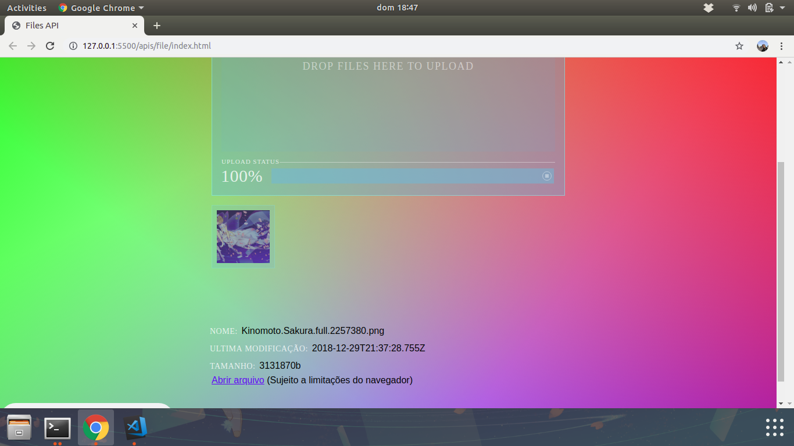

# _Drag and Drop API_

Exemplo de uso da tag de _File_ do HTML5.

## Links do Exemplo

- Link para seminário: [slides de aula][slides]
- Link para exemplo publicado: [página no GitHub][vivo]

## Créditos

Este trabalho foi realizado em 2019/01 para a disciplina de Programação para Web do CEFET-MG no Campus II de Belo Horizonte.

Autores:

1. Larissa de Cássia Nazaré Bicalho ()
2. Vinicius Henrique Silveira (201422040046)

Atribuições:

- Materialize [Site][Materialize-site]
- MDN Canvas Doc [Link][mdn-link]

[slides]: 
[vivo]: